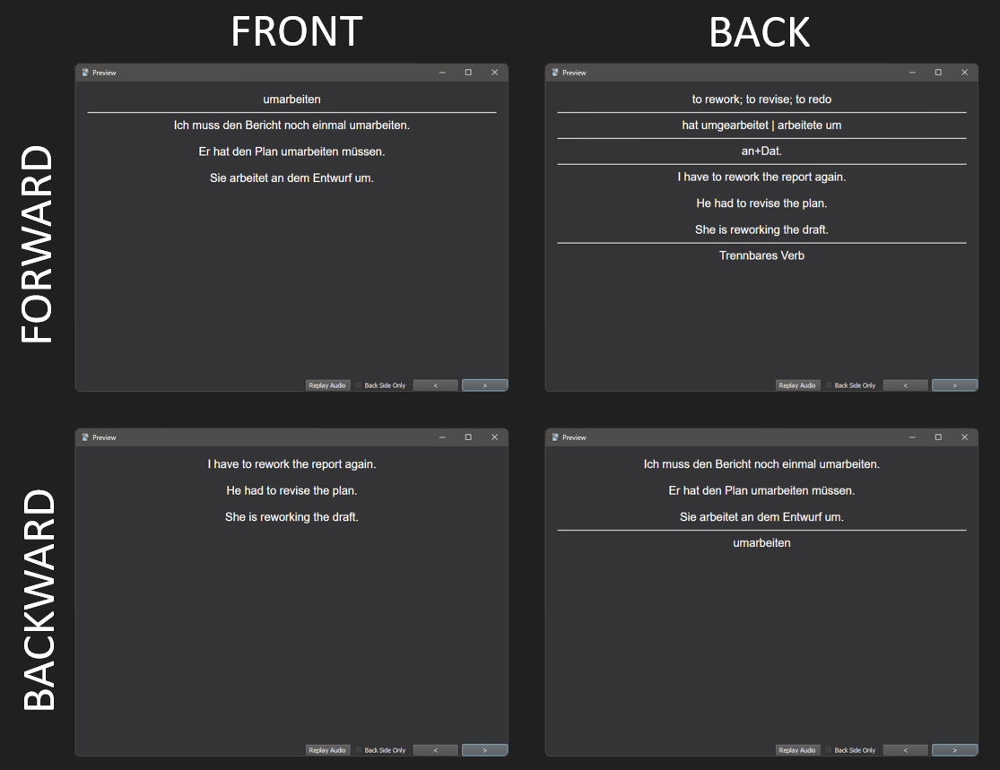

# Karten CLI

A simple CLI application for creating vocabulary flashcards using generative AI, with functionality for bulk flashcard creation from Kindle dictionary lookups. It is very geared to my tastes so your milage may vary.

Note: so far only German (de) and Spanish (es) are implemented.

## Getting started

To install, simply run

```bash
$ pip install https://github.com/kinto-b/karten-cli.git
```

You'll need a key for Google's Generative Language service. Once you've got one, export it 

```bash
$ export GOOGLE_API_KEY="your_key"
```

otherwise you'll need to pass the key around all the time, e.g.

```bash
$ karten card befassen --key "your_key"
```

## Basic usage

The core of the application is a function which sends a word to Google Gemini and requests back a flashcard. 

```bash
$ karten card befassen

{
  "word": "befassen",
  "definition": [
    "to deal with",
    "to concern oneself with"
  ],
  "forms": [
    "hat sich befasst",
    "befasste sich"
  ],
  "preposition": [
    "mit+Dat."
  ],
  "example": [
    "Ich befasse mich mit der deutschen Grammatik.",
    "Er hat sich mit dem Thema Umweltschutz befasst."
  ],
  "reverse": [
    "I am dealing with German grammar.",
    "He has dealt with the topic of environmental protection."
  ],
  "notes": [
    "refexive verb",
    "separable prefix",
    "usually followed by 'mit'"
  ]
}
```

You probably won't use this function directly. Instead of a JSON representation of a single card, you'll probably want a CSV representation of a whole deck of cards, which you can import into Anki (or whatever flashcard app you use). If you already have a list of words, then use

```bash
$ karten deck bereuen Verschwörung --file=./cards.csv
$ cat ./cards.csv | cut -c -80
bereuen,verb,to regret,hat bereut | bereute,"Ich bereue es, dass ich nicht mehr 
hartnäckig,adjective,persistent; stubborn; tenacious,hartnäckiger | am hartnä
die Verschwörung,noun,conspiracy,die Verschwörungen,Es gibt viele Verschwörun
```

You can import the .csv into Anki to get cards like this,



(First download and import the example deck at [./assets/example-deck.apkg](./assets/example-deck.apkg), which contains a card-type with all the required fields.)

## Usage with Kindle

If you've got the 'vocabulary builder' feature turned on on your Kindle, you'll be able to create flashcards by extracting your dictionary lookups. Simply plug in your Kindle, find out which drive it is at (for me thats' `D:/`), and then run

```bash
$ karten kindle-deck D:/ --file=./cards.csv --date-from=2024-08-01
```

This will extract the dictionary lookups from your kindle and export flashcards to `./cards.csv`

You might prefer to inspect the words before you create cards for them. (I do it this way). There will undoubtedly be a bit of dreck in there, so you might be able to save some cloud credits by editing the word list before using it to create cards. You can export just the raw kindle lookups using

```bash
$ karten kindle-words D:/ > words.txt
```

Then once you've filtered out the dreck,

```bash
$ words=$(<words.txt tr -d '\r' | tr '\n' ' ')
$ karten deck $words --file=./cards.csv
```

## A note on costs

I created about 250 cards at a cost of 0.03 euros before deciding to switch the default from the cheaper `gemini-1.5-flash` model to the more powerful `gemini-1.5-pro` model. Using the more powerful model, I would expect the costs to be 15-20 times higher, which will make 250 cards cost roughly 0.50 euros.


